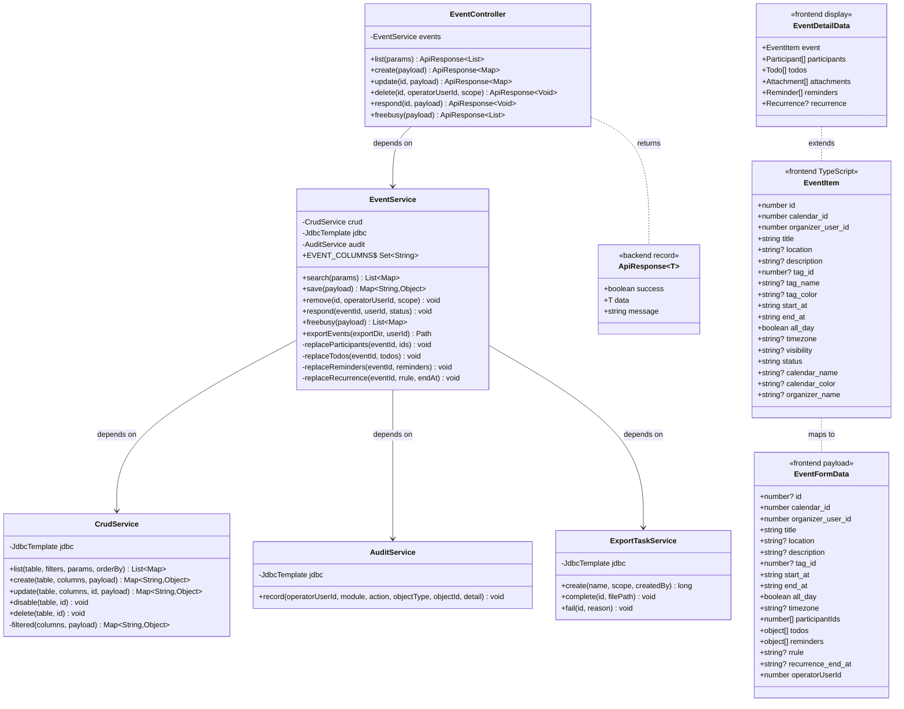
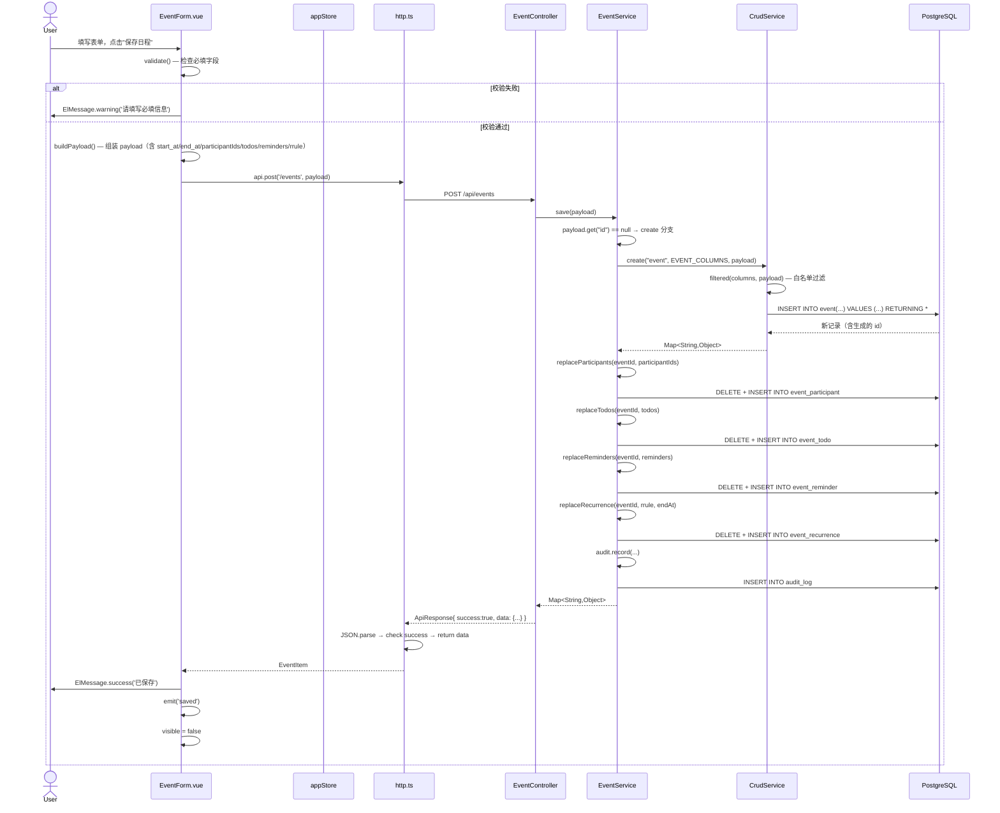
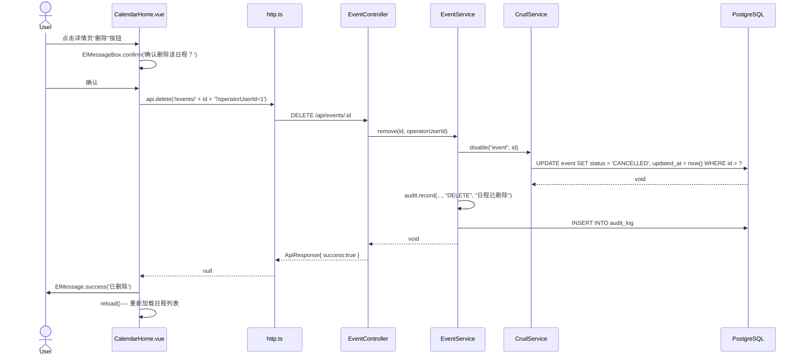
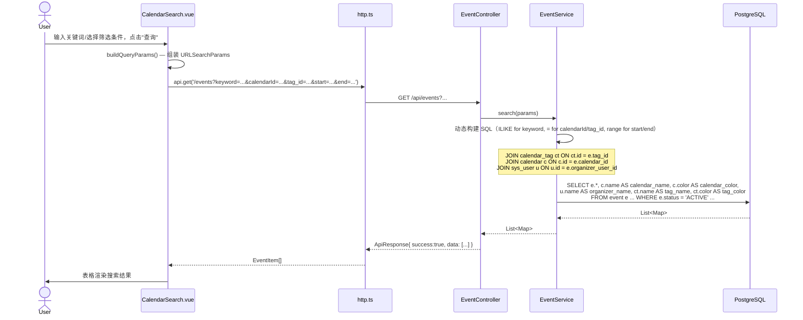
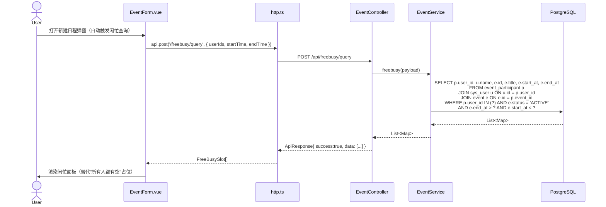
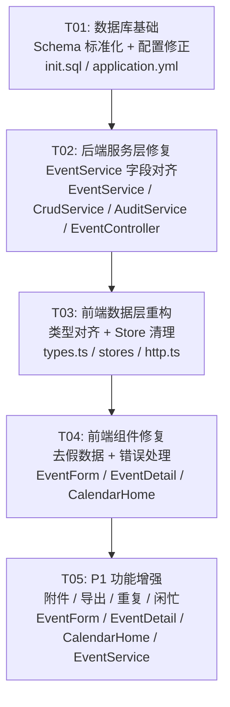

# wwlocal-calendar 最小可用版本 — 系统架构设计 + 任务分解

> 设计人：Bob（Architect）  
> 日期：2026-06-08  
> 目标：修复所有已知 Bug（P0），实现演示增强特性（P1），产出可演示的最小可用版本。

---

## Part A: 系统设计

### 1. 实现方案

#### 1.1 核心技术挑战

| 挑战 | 严重度 | 根因分析 | 解决策略 |
|------|--------|----------|----------|
| 三套冲突的 Schema（`init.sql`、`database/schema.sql`、`resources/database/schema.sql`）导致字段名不一致 | 🔴 P0 | `init.sql` 是完整 Schema 但与 Java 代码字段名不一致；`resources/` 下的 schema 完全过期 | **以 `init.sql` 为标准 Schema**，全链路对齐字段名 |
| EventService 列白名单丢弃前端提交的字段 | 🔴 P0 | `EVENT_COLUMNS` 用 `start_time/end_time/tag/tag_color`，DB 实为 `start_at/end_at/tag_id` | 重写 `EVENT_COLUMNS` 以匹配 `init.sql` 实际列名 |
| 软删除状态值与 CHECK 约束冲突 | 🔴 P0 | `CrudService.disable()` 写 `INACTIVE`，event 表 CHECK 只允许 `ACTIVE/CANCELLED` | 改为 `CANCELLED`（已与 PM 确认软删除语义） |
| ON CONFLICT 无对应唯一约束 | 🔴 P0 | `event_participant` 表缺 `UNIQUE(event_id, user_id)` | 添加唯一约束 |
| 前端假数据 / 空 catch / 假成功提示 | 🟡 P1 | 开发阶段的占位代码未清理 | 移除假数据，修复错误处理 |

#### 1.2 框架与库选型

**不引入新框架**（设计约束）。仅新增必要的工具库：

| 层面 | 现有框架 | 是否替换 | 新增库 |
|------|----------|----------|--------|
| 前端 | Vue 3 + Vite + Element Plus + Pinia | ❌ 不变 | `file-saver`（P1 导出下载） |
| 后端 | Spring Boot 3 + JDK 17 + JdbcTemplate | ❌ 不变 | 无 |
| 数据库 | PostgreSQL 15 | ❌ 不变 | 无 |

#### 1.3 架构模式

保持现有 DDD-lite 分层：

```
Controller (REST 接口)
  ↓
Service (业务逻辑: EventService / CrudService)
  ↓
JdbcTemplate (直接 SQL，通过 CrudService 封装)
  ↓
PostgreSQL (init.sql 为标准 Schema)
```

前端保持现有：`Pinia Store → API Client (fetch) → Component (Vue SFC)`

#### 1.4 核心设计决策

**D-1：以 `database/init.sql` 为唯一标准 Schema**
- 原因：16 个核心表，完整约束（CHECK / FK / UNIQUE），有 seed 数据
- 影响：Java 代码中所有 SQL 字段名需与 init.sql 对齐；前端 TypeScript 类型需对齐

**D-2：字段映射策略 — 全局重命名为 DB 字段名**
- 不引入中间 mapper 层（当前代码量不大，mapper 反而增加复杂度）
- 前端 `EventItem` 直接使用 `start_at/end_at/tag_id`，与 DB 一致
- 需要 `tag_name`/`tag_color` 时通过后端 SQL JOIN 返回

**D-3：tag_id 策略 — 用 FK 引用 calendar_tag 表**
- 移除 event 表上的 `tag`/`tag_color` 扁平字段（init.sql 无此字段）
- 前端「标签」下拉从 `/api/tags` 获取，选中后提交 `tag_id`
- 列表查询时 JOIN `calendar_tag` 返回 `tag_name`/`tag_color`

**D-4：ID 自增策略 — `BIGINT GENERATED BY DEFAULT AS IDENTITY`**
- PostgreSQL 标准自增语法，与 SERIAL/BIGSERIAL 等价但更明确

**D-5：软删除语义 — `status = 'CANCELLED'`**
- 与 event 表 CHECK 约束一致
- `/api/schedules` 路由保留但不推荐使用

---

### 2. 文件列表

#### 2.1 需要修改的文件

```
# ===== 数据库 =====
database/init.sql                                      # 标准 Schema + Seed 数据

# ===== 后端 - 配置 =====
backend/src/main/resources/application.yml             # 数据源与 SQL 初始化配置
backend/src/main/resources/database/schema.sql         # 替换为与 init.sql 一致的版本（或删除）

# ===== 后端 - 服务层 =====
backend/src/main/java/com/wwlocal/calendar/service/EventService.java       # 核心日程业务逻辑
backend/src/main/java/com/wwlocal/calendar/service/CrudService.java        # 通用 CRUD（修复 disable）
backend/src/main/java/com/wwlocal/calendar/service/AuditService.java       # 审计日志（字段名修正）
backend/src/main/java/com/wwlocal/calendar/service/ExportTaskService.java  # 导出任务（字段名修正）

# ===== 后端 - 控制器 =====
backend/src/main/java/com/wwlocal/calendar/controller/EventController.java # 日程接口（增强 DELETE 语义）

# ===== 前端 - 类型与状态 =====
frontend/src/api/types.ts                              # TypeScript 类型定义（字段对齐 DB）
frontend/src/api/http.ts                               # HTTP 客户端（可增强错误处理）
frontend/src/stores/app.ts                             # Pinia 主 Store
frontend/src/stores/calendar.ts                        # 旧 Pinia Store（移除假数据）

# ===== 前端 - 组件与视图 =====
frontend/src/components/EventForm.vue                  # 日程编辑表单
frontend/src/components/EventDetail.vue                # 日程详情抽屉
frontend/src/views/calendar/CalendarHome.vue           # 日历主页
frontend/src/views/calendar/CalendarSearch.vue         # 日程搜索页
```

#### 2.2 不需要修改但需要了解的文件

```
# 参考文件（不改，但要确保兼容）
database/schema.sql                                    # 简化版 Schema（维护用，非运行时）
backend/src/main/java/com/wwlocal/calendar/domain/Entities.java          # 实体定义（record 类，不用于 Event）
backend/src/main/java/com/wwlocal/calendar/dto/Requests.java             # 请求 DTO（不用于 Event 的 Map 入参）
backend/src/main/java/com/wwlocal/calendar/controller/MasterDataController.java  # 用户/部门/日历/标签 CRUD
backend/src/main/java/com/wwlocal/calendar/controller/ScheduleController.java    # 旧 /api/schedules 路由
frontend/src/types/calendar.ts                         # 旧类型定义（供旧 calendar store 用，将废弃）
frontend/src/router/index.ts                           # 路由配置
```

---

### 3. 数据结构和接口

#### 3.1 类图（Mermaid）



#### 3.2 数据库核心表（event 表字段 — 来自 init.sql）

| 列名 | 类型 | 约束 | 说明 |
|------|------|------|------|
| id | BIGINT GENERATED BY DEFAULT AS IDENTITY | PK | 自增主键 |
| calendar_id | BIGINT NOT NULL | FK → calendar | 所属日历 |
| tag_id | BIGINT | FK → calendar_tag | 标签（可选） |
| organizer_user_id | BIGINT NOT NULL | FK → sys_user | 组织者 |
| title | VARCHAR(120) NOT NULL | | 标题 |
| location | VARCHAR(200) | | 地点 |
| description | TEXT | | 描述 |
| start_at | TIMESTAMPTZ NOT NULL | | 开始时间 |
| end_at | TIMESTAMPTZ NOT NULL | CHECK(end_at > start_at) | 结束时间 |
| all_day | BOOLEAN NOT NULL DEFAULT FALSE | | 全天事件 |
| timezone | VARCHAR(60) NOT NULL DEFAULT 'Asia/Shanghai' | | 时区 |
| visibility | VARCHAR(20) NOT NULL DEFAULT 'DEFAULT' | CHECK (DEFAULT/PUBLIC/PRIVATE) | 可见性 |
| status | VARCHAR(20) NOT NULL DEFAULT 'ACTIVE' | CHECK (ACTIVE/CANCELLED) | 状态 |
| created_at | TIMESTAMPTZ NOT NULL DEFAULT NOW() | | 创建时间 |
| updated_at | TIMESTAMPTZ NOT NULL DEFAULT NOW() | | 更新时间 |

#### 3.3 API 接口契约

所有接口前缀：`/api`  
所有响应格式：`{ success: boolean, data: T, message: string }`

| 方法 | 路径 | 说明 | Request Body | Response Data |
|------|------|------|-------------|---------------|
| GET | `/events?keyword=&calendarId=&tag_id=&start=&end=` | 搜索日程 | — | `EventItem[]` |
| POST | `/events` | 创建日程 | `EventFormData` (见上) | `EventItem` |
| PUT | `/events/:id` | 更新日程 | `EventFormData` | `EventItem` |
| DELETE | `/events/:id?operatorUserId=&scope=single` | 删除日程 | — | `null` |
| POST | `/events/:id/respond` | 参会回执 | `{ userId, status }` | `null` |
| POST | `/freebusy/query` | 闲忙查询 | `{ userIds, startTime, endTime }` | `FreeBusySlot[]` |
| POST | `/export/events` | 导出日程 | `{ operatorUserId }` | `{ taskId }` |

**DELETE scope 参数**：
- `scope=single`（默认）：软删除单个事件（`status=CANCELLED`）
- `scope=series`：删除整个系列（后续迭代实现，当前抛 `UnsupportedOperationException`）

---

### 4. 程序调用流程

#### 4.1 创建日程（POST /api/events）



#### 4.2 删除日程（DELETE /api/events/:id）



#### 4.3 搜索日程（GET /api/events）



#### 4.4 闲忙查询（POST /api/freebusy/query）



---

### 5. 待明确事项

| # | 问题 | 当前假设 |
|---|------|----------|
| Q1 | `allow_join` 字段在 init.sql 中不存在，前端 EventForm 有此选项。保留还是移除？ | **移除** — init.sql 的 event 表无此字段，后续通过 calendar 级别的共享机制替代 |
| Q2 | `recurrence_rule` / `recurrence_end` 在 init.sql 中独立为 `event_recurrence` 表。前端表单的「重复」下拉直接提交 rrule 字符串。 | 后端 save() 将 rrule 写入 `event_recurrence` 表 |
| Q3 | 附件上传路径 `../uploads` 是相对路径，生产环境可能不可靠。 | 暂不改动，由部署环境确保 `app.upload-dir` 可写 |
| Q4 | `/api/schedules` 路由是否需要彻底删除还是仅禁用？ | **保留不删**，避免影响旧数据迁移脚本，但前端不再调用 |

---

## Part B: 任务分解

### 6. Required Packages

**前端（无需新增 npm 依赖）**：
```
- vue@^3.4: UI 框架（已有）
- element-plus@^2.x: 组件库（已有）
- pinia@^2.x: 状态管理（已有）
- @element-plus/icons-vue: 图标（已有）
- vite@^5.x: 构建工具（已有）
```

**后端（无需新增 Maven 依赖）**：
```
- spring-boot-starter-web: Web 框架（已有）
- spring-boot-starter-jdbc: JDBC 封装（已有）
- postgresql: PG 驱动（已有）
- apache-poi / poi-ooxml: Excel 生成（已有，用于导出）
```

### 7. Task List

---

#### T01：数据库基础 — Schema 标准化 + 配置修正

| 属性 | 内容 |
|------|------|
| **Task ID** | T01 |
| **优先级** | P0 |
| **对应 Bug** | DB-1, DB-2, DB-3, BE-9 |
| **描述** | 以 `database/init.sql` 为标准 Schema，修复 ID 自增、添加缺失约束、修正 `application.yml` 指向。同步清理过期 Schema 文件。 |

**修改/创建文件**：
1. `database/init.sql` — 所有核心表的 `BIGINT PRIMARY KEY` → `BIGINT GENERATED BY DEFAULT AS IDENTITY`；`event_participant` 添加 `UNIQUE(event_id, user_id)`；确保 `event` 表字段与代码一致
2. `backend/src/main/resources/application.yml` — `schema-locations` 和 `data-locations` 指向正确的 `classpath:database/schema.sql`（或改为 `never` 让 DBA 手动初始化）
3. `backend/src/main/resources/database/schema.sql` — 替换为与 `init.sql` 一致的精简版本（仅 DDL，无 seed 数据），或直接删除此文件

**依赖关系**：无（首个任务）

---

#### T02：后端服务层修复 — EventService 全链路字段对齐 + CrudService 逻辑修正

| 属性 | 内容 |
|------|------|
| **Task ID** | T02 |
| **优先级** | P0 |
| **对应 Bug** | BE-1, BE-2, BE-3, BE-4, BE-5, BE-6, BE-7, BE-8 |
| **描述** | 修复 EventService 中所有 SQL 字段名以匹配 `init.sql` 标准 Schema；修复 CrudService.disable() 状态值；修复 AuditService 字段名；补全 DELETE scope=single 实现。 |

**修改/创建文件**：
1. `backend/src/main/java/com/wwlocal/calendar/service/EventService.java`
   - `EVENT_COLUMNS`：`start_time`→`start_at`, `end_time`→`end_at`, `tag`→`tag_id`, `tag_color`移除, `recurrence_rule`移除, `recurrence_end`移除, `allow_join`移除；新增 `timezone`, `visibility`
   - `search()`：SQL 中 `e.start_time`→`e.start_at`, `e.end_time`→`e.end_at`, `e.tag`→`e.tag_id`；JOIN `calendar_tag` 返回 `tag_name`/`tag_color`
   - `save()`：补全 `replaceReminders()` 和 `replaceRecurrence()` 调用
   - `remove()`：实现 scope=single 软删除（`status=CANCELLED`），scope=series 抛异常
   - `freebusy()`：SQL 中 `e.start_time`→`e.start_at`, `e.end_time`→`e.end_at`
   - `exportEvents()`：Excel 列名用新字段名；`export_task` INSERT 中 `task_name`→`name`, `export_scope`→`scope`, `completed_at`→`finished_at`
2. `backend/src/main/java/com/wwlocal/calendar/service/CrudService.java`
   - `disable()`：`SET status = 'INACTIVE'` → `SET status = 'CANCELLED'`
3. `backend/src/main/java/com/wwlocal/calendar/service/AuditService.java`
   - `record()`：INSERT 中 `change_summary` → `detail`
4. `backend/src/main/java/com/wwlocal/calendar/controller/EventController.java`
   - `delete()` 增加 `@RequestParam(required = false, defaultValue = "single") String scope` 参数，传递给 `remove()`

**依赖关系**：T01（Database Schema 必须先用 init.sql 建表）

---

#### T03：前端数据层重构 — 类型对齐 + Store 清理 + 搜索实装

| 属性 | 内容 |
|------|------|
| **Task ID** | T03 |
| **优先级** | P0 |
| **对应 Bug** | FE-1, FE-5, FE-6 |
| **描述** | 修正 TypeScript 类型定义以匹配后端/DB 字段名；清理 calendar store 假数据；确保搜索页正确使用后端 API 并传递正确参数。 |

**修改/创建文件**：
1. `frontend/src/api/types.ts` — `EventItem` 接口：
   - `start_time` → `start_at`
   - `end_time` → `end_at`
   - `tag?: string` → `tag_id?: number`
   - `tag_color?: string` → `tag_name?: string; tag_color?: string`（来自 JOIN）
   - `recurrence_rule` → 移除（改为从 event_recurrence JOIN 或单独查询）
   - `allow_join` → 移除
   - 新增 `timezone?: string; visibility?: string`
2. `frontend/src/stores/calendar.ts` — 移除所有硬编码假数据（`calendars`、`events` 数组置空或设为 `[]`）；`saveEvent()` 改为不做本地状态修改（或标记为 deprecated）
3. `frontend/src/stores/app.ts` — `loadEvents()` 接受可选查询参数；确保 `currentUserId` 在后端返回用户列表后正确 fallback
4. `frontend/src/views/calendar/CalendarSearch.vue` — `search()` 中参数 `tag`→`tag_id`；表格列绑定 `tag_name`/`tag_color` 而非旧字段；如果搜索结果为空则展示 empty 提示
5. `frontend/src/api/http.ts` — 增强 `ApiResult` 类型的 `success` 字段与后端 `ApiResponse` 对齐（当前已对齐，确认即可）

**依赖关系**：T02（后端接口字段名修正后才能对齐前端类型）

---

#### T04：前端组件修复 — EventForm / EventDetail / CalendarHome 去假数据 + 错误处理

| 属性 | 内容 |
|------|------|
| **Task ID** | T04 |
| **优先级** | P0 + P1 |
| **对应 Bug** | FE-2, FE-3, FE-4, FE-7, FE-8, P0-1, P0-2, P0-3, P0-4, P0-5 |
| **描述** | 修复 EventForm 的空 catch 和假成功提示；移除 CalendarHome 的 localCalendars/localEvents fallback；修复导出错误处理；补全 EventDetail 的信息展示。 |

**修改/创建文件**：
1. `frontend/src/components/EventForm.vue`
   - **FE-2**：`catch {}` 空块 → `catch (err) { ElMessage.error('保存失败：' + (err.message || '未知错误')); return; }`；`ElMessage.success('已保存')` 移到 try 块末尾
   - **字段对齐**：`form.tag` → `form.tag_id`；`form.tag_color` → 移除；`start_time/end_time` → `start_at/end_at`
   - **P1-2/P1-3**：补全「提醒」下拉（5/15/30/60 分钟前）→ 实际写入 `reminders` 数组；补全「待办」输入区（标题 + 负责人 + 优先级）
   - **P1-4**：「重复」选项值需要对齐 `event_recurrence` 表结构（rrule + end_at）
   - **P1-1**：「添加附件」按钮从占位变为真实上传（`<input type="file">` + `FormData` POST）
2. `frontend/src/components/EventDetail.vue`
   - **FE-7**：补全参与人列表（回执状态标签）、提醒列表、附件列表、待办列表的展示区域
   - 需要额外 API 调用获取详情数据（`GET /api/events/:id/detail` 或从列表数据中展开）
3. `frontend/src/views/calendar/CalendarHome.vue`
   - **FE-3**：移除 `localCalendars` / `localEvents` 硬编码 fallback
   - **FE-4**：`exportEvents()` catch 中 `ElMessage.success` → `ElMessage.error`
   - **字段对齐**：所有 `event.start_time/end_time` → `event.start_at/end_at`；`event.tag` → `event.tag_name`；`event.tag_color` → 从 JOIN 获取的 `event.tag_color`
   - **FE-8**：闲忙面板 `free-block` 移除「所有人都有空」写死文案，改为调用 `/api/freebusy/query` 真实数据（复用 EventForm 中的逻辑）
4. `frontend/src/views/calendar/CalendarSearch.vue`
   - 表格列绑定 `start_time`→`start_at`, `end_time`→`end_at`
   - `tag` 列名改为展示 `tag_name`

**依赖关系**：T03（类型定义修改后方可编译通过）

---

#### T05：P1 功能增强 — 附件上传 / 导出下载 / 重复日程 / 闲忙面板

| 属性 | 内容 |
|------|------|
| **Task ID** | T05 |
| **优先级** | P1 |
| **对应 Bug** | P1-1, P1-2, P1-3, P1-4, P1-5, P1-6, P1-7 |
| **描述** | 实现附件上传/下载/删除、导出 xlsx 下载、重复日程 RRULE 保存与展开、闲忙面板真实查询、参与人回执流程完善。 |

**修改/创建文件**：
1. `frontend/src/components/EventForm.vue`
   - **P1-1**：附件上传 — `<el-upload>` 组件挂载，上传到 `/api/attachments/upload`，展示已上传列表
   - **P1-2**：待办管理 — 动态添加/删除行，支持标题/负责人/优先级/截止时间
   - **P1-3**：提醒设置 — 多选提醒时间（可多个提醒），回显已有提醒
   - **P1-4**：重复规则 — 增加「结束日期」/「重复次数」选择器，与 rrule 组合
2. `frontend/src/components/EventDetail.vue`
   - **P1-1/P1-7**：展示附件列表（可下载）、待办列表（可勾选完成）、参与人回执状态（带颜色标签）
   - **P1-7**：接受/拒绝/待定按钮 → 调用 `/api/events/:id/respond`（当前已有逻辑，确保正确触达）
3. `frontend/src/views/calendar/CalendarHome.vue`
   - **P1-5**：导出 — 调用 `/api/export/events` 后，轮询或直接获取下载链接，触发浏览器下载
   - **P1-6**：闲忙面板 — 在 EventForm 的 availability-pane 中真实调用 `/api/freebusy/query`，渲染忙闲时间槽
4. `backend/src/main/java/com/wwlocal/calendar/service/EventService.java`
   - **P1-1**：补充附件元数据保存/查询逻辑（`event_attachment` 表的读写）
   - **P1-4**：`replaceRecurrence()` 实现 — upsert 到 `event_recurrence` 表
   - **P1-5**：`exportEvents()` 修复字段名并支持下载 token
5. `backend/src/main/java/com/wwlocal/calendar/controller/EventController.java`（或新建 `AttachmentController.java`）
   - **P1-1**：新增 `POST /api/attachments/upload` 和 `DELETE /api/attachments/:id`

**依赖关系**：T04（基础组件功能修复后，再做界面增强）

---

### 8. Shared Knowledge

#### 8.1 字段映射速查表

```
Java/前端旧字段名        →  DB 标准字段名 (init.sql)      备注
─────────────────────────────────────────────────────────────────
start_time              →  start_at                        event 表
end_time                →  end_at                          event 表
tag                     →  tag_id (FK → calendar_tag.id)   event 表
tag_color               →  通过 JOIN calendar_tag 获取      event 表移除该列
recurrence_rule         →  event_recurrence.rrule           独立表
recurrence_end          →  event_recurrence.end_at          独立表
allow_join              →  （移除，init.sql 无此字段）       event 表
task_name               →  name                            export_task 表
export_scope            →  scope                           export_task 表
completed_at            →  finished_at                     export_task 表
change_summary          →  detail                          audit_log 表
```

#### 8.2 错误码规范

所有 API 响应遵循统一格式：

```json
{
  "success": true | false,
  "data": ...,
  "message": "OK" | "错误描述"
}
```

- `success: true` → HTTP 200，`data` 包含结果
- `success: false` → HTTP 200（业务异常，如校验失败）或 HTTP 400/404/500
- 前端 `http.ts` 的 `request()` 已处理：非 2xx 抛 `Error('请求失败：' + status)`，`!result.success` 抛 `Error(result.message)`

#### 8.3 当前用户约定

- **currentUserId = 1**（李宇航），硬编码在 `stores/app.ts`
- 所有写操作需携带 `operatorUserId` → 目前固定为 `currentUserId`
- 闲忙查询以 `currentUserId` 为默认查询对象

#### 8.4 数据库初始化约定

- **生产环境**：使用 `database/init.sql` 初始化（含 seed 数据）
- **开发环境**：`application.yml` 中 `spring.sql.init.mode=always` 指向 `classpath:database/schema.sql`（仅 DDL，无 seed）
- **本地测试**：可在 `application.yml` 中设置 `SQL_INIT_MODE=never`，手动 `psql < database/init.sql`

#### 8.5 软删除语义

- `event.status = 'ACTIVE'` — 正常
- `event.status = 'CANCELLED'` — 已删除（软删除）
- 所有查询默认过滤 `WHERE e.status = 'ACTIVE'`
- 不存在物理删除 event 的路径

#### 8.6 时间格式约定

- DB 存储：`TIMESTAMPTZ`（带时区）
- API 传输：ISO 8601 字符串（如 `2026-06-08T09:30:00+08:00`）
- 前端展示：`new Date(value).toLocaleString('zh-CN', { hour12: false })`

---

### 9. Task Dependency Graph



---

### 附录 A：Bug 覆盖矩阵

| Bug ID | 描述 | 对应任务 | 修复文件 |
|--------|------|----------|----------|
| DB-1 | init.sql 表用 BIGINT 无自增 | T01 | `database/init.sql` |
| DB-2 | event_participant 缺 UNIQUE 约束 | T01 | `database/init.sql` |
| DB-3 | resources/database/schema.sql 完全过期 | T01 | `backend/.../database/schema.sql` |
| BE-1 | EVENT_COLUMNS 字段名 7 个不一致 | T02 | `EventService.java` |
| BE-2 | disable() 写 INACTIVE 与 CHECK 冲突 | T02 | `CrudService.java` |
| BE-3 | respond() ON CONFLICT 无对应约束 | T01 + T02 | `init.sql` + `EventService.java` |
| BE-4 | exportEvents 字段名与 DB 不一致 | T02 | `EventService.java` |
| BE-5 | search() 用 start_time/end_time | T02 | `EventService.java` |
| BE-6 | freebusy() 用 start_time/end_time | T02 | `EventService.java` |
| BE-7 | save() 缺 reminders/recurrence | T02 + T05 | `EventService.java` |
| BE-8 | DELETE scope 未实现 | T02 | `EventService.java` + `EventController.java` |
| BE-9 | application.yml 指向错误 schema | T01 | `application.yml` |
| FE-1 | calendarStore.saveEvent 只 push 内存 | T03 | `stores/calendar.ts` |
| FE-2 | EventForm catch {} 空块 | T04 | `EventForm.vue` |
| FE-3 | localCalendars/localEvents 假 fallback | T04 | `CalendarHome.vue` |
| FE-4 | exportEvents catch 里也 success | T04 | `CalendarHome.vue` |
| FE-5 | CalendarSearch 用旧 store | T03 | `CalendarSearch.vue` |
| FE-6 | EventItem 用 start_time/end_time/tag | T03 | `api/types.ts` |
| FE-7 | EventDetail 缺少提醒/附件/待办展示 | T04 + T05 | `EventDetail.vue` |
| FE-8 | 闲忙面板写死"所有人都有空" | T04 + T05 | `CalendarHome.vue` + `EventForm.vue` |
